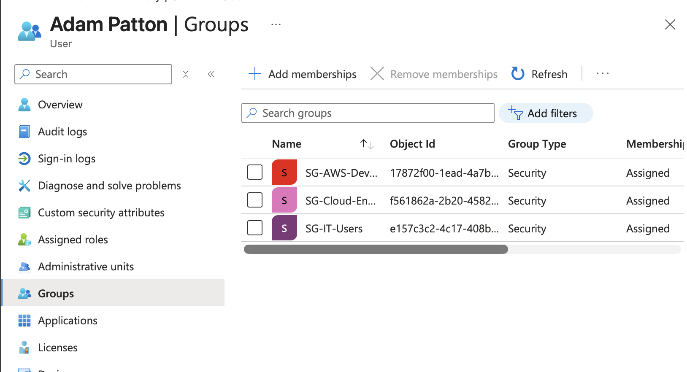
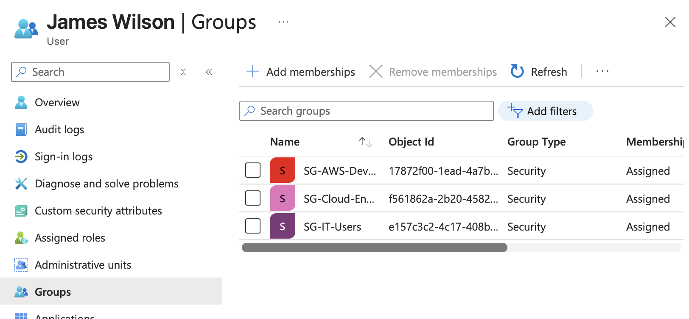
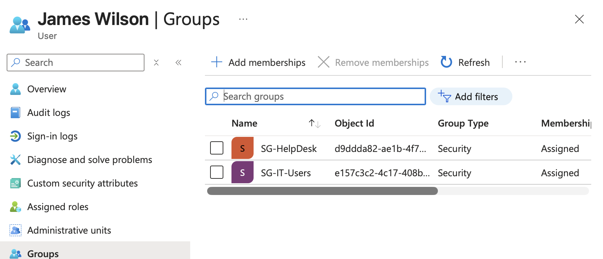
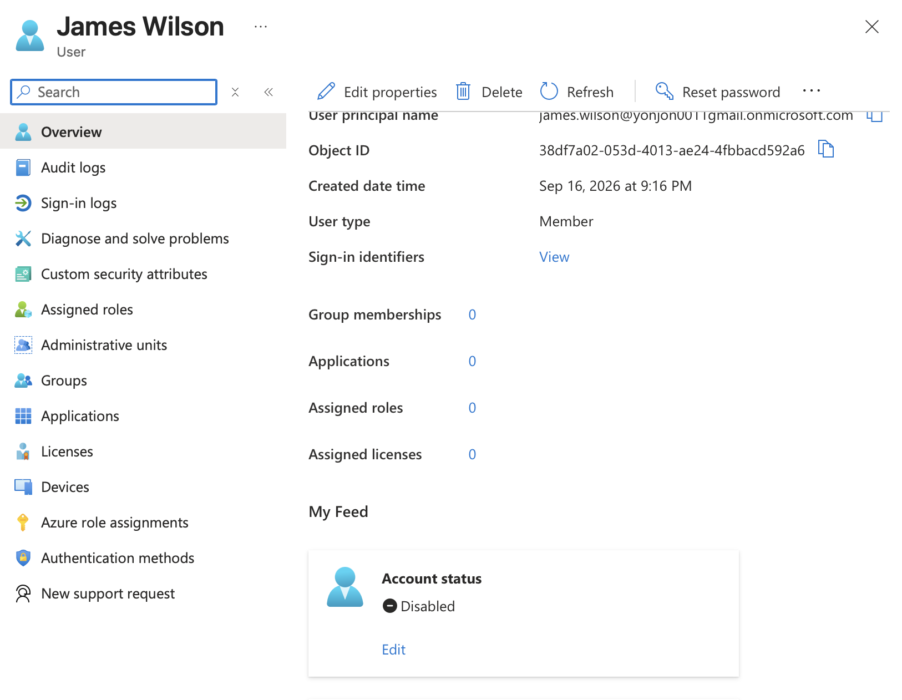
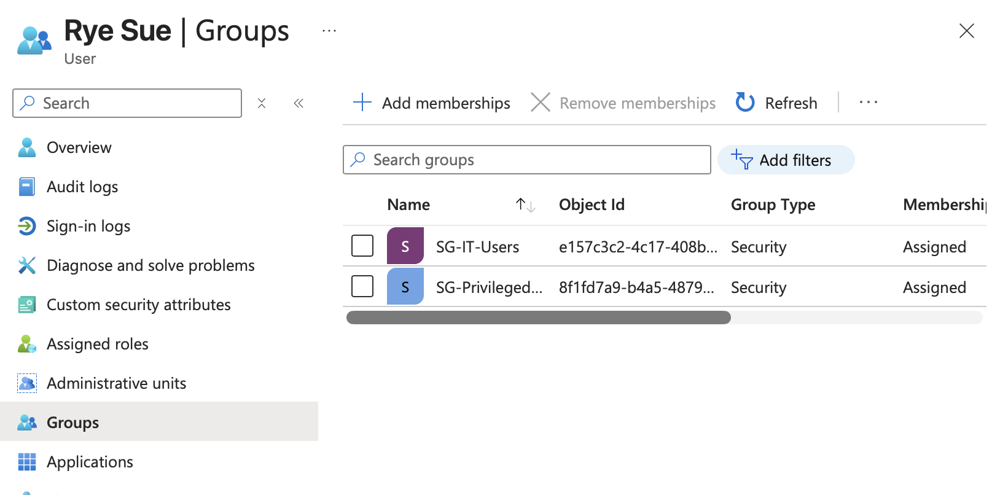
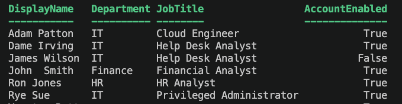
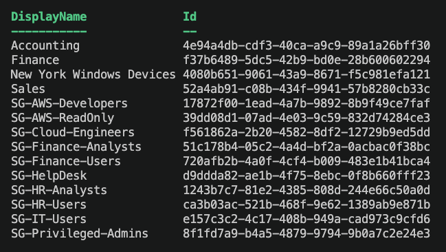
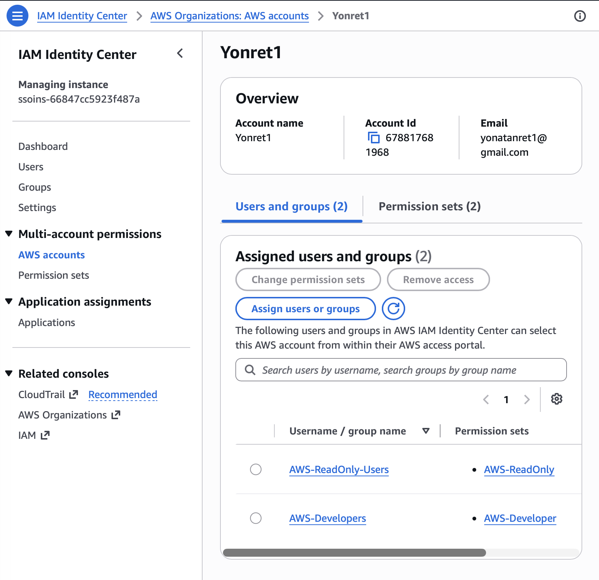

# Identity Governance & Privileged Access Automation Lab

## Project Overview

This project demonstrates identity governance, role-based access control, privileged access, automation, Microsoft Graph, and AWS IAM Identity Center concepts in a hands-on lab environment.

The fictional organization used for this lab is **Cinder Time**.

The project focuses on automating identity lifecycle management and enforcing least-privilege access across Microsoft Entra ID and AWS.

---

## Technologies Used

- Microsoft Entra ID
- Microsoft Graph PowerShell
- PowerShell 7
- Visual Studio Code
- AWS IAM Identity Center
- AWS IAM Permission Sets
- GitHub
- CSV audit reporting

---

## Project Objectives

This lab demonstrates:

- Joiner, mover, and leaver workflows
- Role-based access control
- Group-based access assignment
- Identity lifecycle automation
- Access remediation
- Privileged access review
- Temporary privileged access
- Microsoft Graph automation
- AWS IAM Identity Center
- Least-privilege access
- Audit reporting

---

## Lab Environment

### Departments

- IT
- Finance
- Human Resources

### Example Job Roles

- Cloud Engineer
- Help Desk Analyst
- Financial Analyst
- HR Analyst
- Privileged Administrator

---

## Microsoft Entra ID RBAC Model

Security groups were created to represent department and role-based access.

### IT Groups

- SG-IT-Users
- SG-Cloud-Engineers
- SG-HelpDesk

### Finance Groups

- SG-Finance-Users
- SG-Finance-Analysts

### HR Groups

- SG-HR-Users
- SG-HR-Analysts

### AWS Access Groups

- SG-AWS-Developers
- SG-AWS-ReadOnly

### Privileged Access Group

- SG-Privileged-Admins

The RBAC mapping is documented in:

```text
reports/rbac-model.csv
```

---

## RBAC Automation

The `assign-rbac.ps1` script assigns users to security groups based on their business role.

Example:

```text
Cloud Engineer
    ↓
SG-IT-Users
SG-Cloud-Engineers
SG-AWS-Developers
```

This demonstrates group-based authorization instead of assigning permissions directly to individual users.

Script:

```text
powershell/assign-rbac.ps1
```

---

## Joiner Workflow

The Joiner workflow automates onboarding for a new employee.

The script:

- Creates the user in Microsoft Entra ID
- Assigns department
- Assigns job title
- Assigns role-based security groups

Example user:

```text
James Wilson
Department: IT
Job Title: Cloud Engineer
```

Access assigned:

```text
SG-IT-Users
SG-Cloud-Engineers
SG-AWS-Developers
```

Script:

```text
powershell/joiner.ps1
```

---

## Mover Workflow

The Mover workflow demonstrates access changes when an employee changes job roles.

Example:

```text
Before:
Cloud Engineer

After:
Help Desk Analyst
```

Old access removed:

```text
SG-Cloud-Engineers
SG-AWS-Developers
```

New access assigned:

```text
SG-HelpDesk
```

Baseline IT access remained:

```text
SG-IT-Users
```

Script:

```text
powershell/mover.ps1
```

This demonstrates least privilege by removing access that is no longer required.

---

## Leaver Workflow

The Leaver workflow automates offboarding.

The script:

- Disables the Entra ID account
- Revokes active sign-in sessions
- Removes group memberships

After the workflow completed, the user showed:

```text
Account status: Disabled
Group memberships: 0
```

Script:

```text
powershell/leaver.ps1
```

---

## Audit Reporting

The lab generates an identity access report using Microsoft Graph PowerShell.

The report includes:

- Display name
- User principal name
- Department
- Job title
- Account status
- Group membership

Output:

```text
reports/identity-access-report.csv
```

Script:

```text
powershell/access-report.ps1
```

The report also confirms that offboarded users no longer retain access.

---

## Access Review and Entitlement Remediation

Native Microsoft Entra Access Reviews require additional Microsoft Entra ID Governance licensing.

Because the lab tenant did not include that licensing, access review remediation was demonstrated using PowerShell.

Example:

```text
User: Adam Patton
Group: SG-AWS-Developers
Decision: Remove access
```

The script removed the user's unnecessary entitlement from the security group.

Script:

```text
powershell/group-audit.ps1
```

This demonstrates entitlement review and access remediation concepts.

---

## Privileged Access

Privileged access was modeled using:

```text
SG-Privileged-Admins
```

The lab included:

- Privileged group membership auditing
- Removal of standing privileged access
- Temporary privileged access
- Automatic privileged access removal

Privileged access audit:

```text
powershell/privileged-access-audit.ps1
```

Temporary access workflow:

```text
powershell/temporary-privileged-access.ps1
```

The workflow demonstrates:

```text
No Privileged Access
        ↓
Temporary Access Activated
        ↓
Privileged Group Membership
        ↓
Access Expires
        ↓
Membership Removed
```

This simulates just-in-time privileged access concepts.

---

## Microsoft Graph Automation

Microsoft Graph PowerShell was used to query Microsoft Entra ID directly.

### User Query

The Graph user script returns:

- Display name
- Department
- Job title
- Account status

Script:

```text
graph/graph-users.ps1
```

Example output:

```text
DisplayName    Department   JobTitle                  AccountEnabled
-----------    ----------   --------                  --------------
Adam Patton    IT           Cloud Engineer            True
Dame Irving    IT           Help Desk Analyst         True
James Wilson   IT           Help Desk Analyst         False
John Smith     Finance      Financial Analyst         True
Ron Jones      HR           HR Analyst                True
Rye Sue        IT           Privileged Administrator  True
```

### Group Query

The Graph group script returns:

- Group name
- Group object ID

Script:

```text
graph/graph-groups.ps1
```

This demonstrates programmatic access to identity data instead of relying only on the Entra admin portal.

---

## AWS IAM Identity Center

AWS IAM Identity Center was configured to extend the identity governance model into AWS.

A Single-Region IAM Identity Center instance was used for the lab.

### Identity Center Groups

```text
AWS-Developers
AWS-ReadOnly-Users
```

### Permission Sets

```text
AWS-Developer
AWS-ReadOnly
```

---

## AWS Developer Permission Set

The `AWS-Developer` permission set was created as a custom permission set.

The following AWS managed policies were attached:

```text
AmazonEC2FullAccess
AmazonS3FullAccess
AmazonEC2ContainerRegistryFullAccess
```

AdministratorAccess was intentionally not assigned.

This demonstrates a more restricted developer access model instead of unrestricted administrative access.

---

## AWS Read-Only Permission Set

The `AWS-ReadOnly` permission set uses the AWS managed policy:

```text
ReadOnlyAccess
```

This provides view-only access to AWS services and resources.

---

## AWS Identity Center Users

Test users were created in AWS IAM Identity Center to simulate cross-cloud identity access.

### Adam Patton

Assigned to:

```text
AWS-Developers
```

Permission set:

```text
AWS-Developer
```

### John Smith

Assigned to:

```text
AWS-ReadOnly-Users
```

Permission set:

```text
AWS-ReadOnly
```

---

## AWS Access Model

The AWS access model follows this structure:

```text
AWS Identity Center User
        ↓
Identity Center Group
        ↓
Permission Set
        ↓
AWS Account
```

Example developer workflow:

```text
Adam Patton
    ↓
AWS-Developers
    ↓
AWS-Developer
    ↓
AWS Account
```

Example read-only workflow:

```text
John Smith
    ↓
AWS-ReadOnly-Users
    ↓
AWS-ReadOnly
    ↓
AWS Account
```

This demonstrates centralized authorization, group-based access, and least-privilege access in AWS.

---

## Identity Lifecycle Flow

The overall identity lifecycle demonstrated in the project is:

```text
JOINER
New Employee
    ↓
Entra ID Account Created
    ↓
Department and Job Title Assigned
    ↓
RBAC Groups Assigned
    ↓
Application / AWS Access Granted
```

```text
MOVER
Existing Employee
    ↓
Job Role Changes
    ↓
Old Access Identified
    ↓
Old Groups Removed
    ↓
New Role-Based Groups Assigned
```

```text
LEAVER
Employee Leaves
    ↓
Account Disabled
    ↓
Sign-In Sessions Revoked
    ↓
Group Memberships Removed
    ↓
Access Removed
    ↓
Audit Report Updated
```

---

## Privileged Access Flow

The privileged access simulation follows this workflow:

```text
User Has No Standing Privileged Access
        ↓
Temporary Access Requested / Activated
        ↓
User Added to SG-Privileged-Admins
        ↓
Administrative Work Performed
        ↓
Temporary Access Expires
        ↓
User Removed from SG-Privileged-Admins
```

This simulates just-in-time access and reduces standing privilege.

---

## Access Review Flow

Because native Entra Access Reviews were unavailable due to licensing, entitlement remediation was demonstrated with PowerShell.

```text
Identify User Entitlement
        ↓
Review Business Need
        ↓
Decision: Access No Longer Required
        ↓
Remove Group Membership
        ↓
Verify Remediation
```

Example:

```text
Adam Patton
    ↓
SG-AWS-Developers
    ↓
Access Review
    ↓
Remove Access
```

---

## Audit Reporting Flow

Microsoft Graph PowerShell was used to query identity information and generate a CSV audit report.

```text
Microsoft Entra ID
        ↓
Microsoft Graph
        ↓
PowerShell
        ↓
User + Group Data
        ↓
CSV Audit Report
```

The generated report includes:

- Display name
- User principal name
- Department
- Job title
- Account status
- Group membership

Report:

```text
reports/identity-access-report.csv
```

---

## Project Structure

```text
identity-governance-privileged-access-lab/
│
├── README.md
│
├── aws/
│   ├── identity-center.md
│   └── permission-sets.md
│
├── diagrams/
│
├── graph/
│   ├── graph-users.ps1
│   └── graph-groups.ps1
│
├── powershell/
│   ├── access-report.ps1
│   ├── assign-rbac.ps1
│   ├── group-audit.ps1
│   ├── joiner.ps1
│   ├── leaver.ps1
│   ├── mover.ps1
│   ├── privileged-access-audit.ps1
│   └── temporary-privileged-access.ps1
│
├── reports/
│   ├── rbac-model.csv
│   └── identity-access-report.csv
│
└── screenshots/
```

---

## Scripts

### RBAC Assignment

```text
powershell/assign-rbac.ps1
```

Used to assign existing test users to the appropriate security groups based on role.

### Joiner

```text
powershell/joiner.ps1
```

Creates a new employee and automatically assigns role-based access.

### Mover

```text
powershell/mover.ps1
```

Updates an employee's job role, removes obsolete access, and assigns new access.

### Leaver

```text
powershell/leaver.ps1
```

Disables an account, revokes sessions, and removes group memberships.

### Access Report

```text
powershell/access-report.ps1
```

Queries users and group memberships and exports an identity access report.

### Group Audit / Entitlement Remediation

```text
powershell/group-audit.ps1
```

Demonstrates entitlement review and removal of unnecessary access.

### Privileged Access Audit

```text
powershell/privileged-access-audit.ps1
```

Checks whether a user currently has privileged group membership.

### Temporary Privileged Access

```text
powershell/temporary-privileged-access.ps1
```

Temporarily grants privileged access and removes the access after the simulated privileged session ends.

### Microsoft Graph User Query

```text
graph/graph-users.ps1
```

Queries Entra ID users and displays department, job title, and account status.

### Microsoft Graph Group Query

```text
graph/graph-groups.ps1
```

Queries Entra ID groups and returns group names and object IDs.

---

## Screenshots

The `screenshots` directory contains evidence of the project configuration and automation results.

### RBAC Assignment



### Joiner Workflow



### Mover Workflow



### Leaver Workflow



### Privileged Access



### Microsoft Graph





### AWS IAM Identity Center



---
## Example Evidence

### RBAC Evidence

Security groups were created in Entra ID for IT, HR, Finance, AWS access, and privileged access.

Users were then assigned to the appropriate groups using PowerShell automation.

### Joiner Evidence

James Wilson was automatically created as:

```text
Department: IT
Job Title: Cloud Engineer
```

and assigned:

```text
SG-IT-Users
SG-Cloud-Engineers
SG-AWS-Developers
```

### Mover Evidence

James Wilson moved from:

```text
Cloud Engineer
```

to:

```text
Help Desk Analyst
```

His old groups were removed:

```text
SG-Cloud-Engineers
SG-AWS-Developers
```

and his new access was assigned:

```text
SG-HelpDesk
```

### Leaver Evidence

After running the Leaver workflow:

```text
Account status: Disabled
Group memberships: 0
```

### Privileged Access Evidence

The privileged access simulation captured three states:

```text
Part 1:
No privileged membership

Part 2:
Temporary privileged membership active

Part 3:
Privileged membership removed
```

### AWS Evidence

The AWS account was assigned:

```text
AWS-Developers
→ AWS-Developer
```

and:

```text
AWS-ReadOnly-Users
→ AWS-ReadOnly
```

---

## Security Considerations

This repository does not intentionally contain:

- Passwords
- AWS access keys
- Microsoft Graph tokens
- Client secrets
- Private keys
- Authentication tokens
- Production data

All company names and user identities used in this lab are fictional test data.

Temporary passwords used during testing should not be committed to a public GitHub repository.

---

## Limitations

Native Microsoft Entra Access Reviews and Privileged Identity Management functionality require additional Microsoft Entra licensing.

The lab tenant did not include the required Microsoft Entra ID Governance licensing.

Because of this:

- Access review remediation was simulated using Microsoft Graph PowerShell.
- Temporary privileged access was simulated using controlled security group membership.

These workflows demonstrate the underlying governance and least-privilege concepts without claiming to implement native Entra PIM or native Access Reviews.

---

## Key IAM Concepts Demonstrated

This project demonstrates practical IAM concepts including:

- Identity lifecycle management
- Joiner, mover, leaver automation
- Role-based access control
- Group-based access management
- Least privilege
- Entitlement remediation
- Access reviews
- Privileged access governance
- Temporary elevated access
- Microsoft Graph automation
- PowerShell automation
- Cross-cloud IAM
- AWS IAM Identity Center
- AWS permission sets
- Audit reporting
- Automated onboarding
- Automated offboarding
- Removal of stale access

---

## What I Learned

This lab provided hands-on experience managing identities throughout their lifecycle.

I learned how to use Microsoft Entra ID attributes such as department and job title to support role-based access decisions.

I also automated common IAM tasks using PowerShell and Microsoft Graph, including account creation, group assignment, access modification, account disabling, session revocation, and access reporting.

The project also demonstrated why removing unnecessary access is just as important as granting access.

By extending the project into AWS IAM Identity Center, I gained experience with group-based AWS authorization and permission sets.

The project reinforced the importance of least privilege, access reviews, privileged access controls, automation, and auditability in an enterprise IAM environment.

---

## Final Architecture

```text
                         Cinder Time
                              │
                              ▼
                     Microsoft Entra ID
                              │
             ┌────────────────┼────────────────┐
             │                │                │
             ▼                ▼                ▼
          Users            Groups         Job Attributes
             │                │                │
             └────────────────┼────────────────┘
                              │
                              ▼
                             RBAC
                              │
             ┌────────────────┼────────────────┐
             │                │                │
             ▼                ▼                ▼
          Joiner            Mover            Leaver
             │                │                │
             └────────────────┼────────────────┘
                              │
                              ▼
                    Microsoft Graph API
                              │
                              ▼
                     PowerShell Automation
                              │
                ┌─────────────┴─────────────┐
                │                           │
                ▼                           ▼
        Audit Reporting            Access Remediation
                │                           │
                └─────────────┬─────────────┘
                              │
                              ▼
                      Privileged Access
                              │
                              ▼
                    Temporary Elevation
                              │
                              ▼
                    AWS IAM Identity Center
                              │
                ┌─────────────┴─────────────┐
                │                           │
                ▼                           ▼
         AWS-Developers             AWS-ReadOnly-Users
                │                           │
                ▼                           ▼
         AWS-Developer                AWS-ReadOnly
         Permission Set               Permission Set
                │                           │
                └─────────────┬─────────────┘
                              │
                              ▼
                         AWS Account
```

---

## Conclusion

This lab demonstrates an end-to-end identity governance and privileged access model across Microsoft Entra ID and AWS.

The project combines identity lifecycle management, RBAC, least privilege, Microsoft Graph automation, PowerShell, access remediation, privileged access controls, AWS IAM Identity Center, and audit reporting.

The result is a practical portfolio project that demonstrates how IAM processes can be automated, governed, reviewed, and audited across cloud environments.